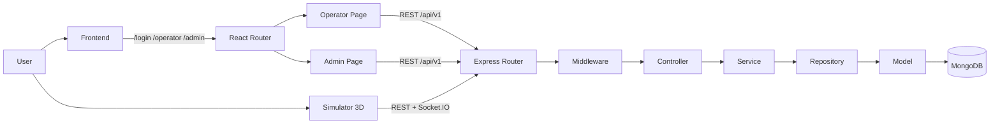
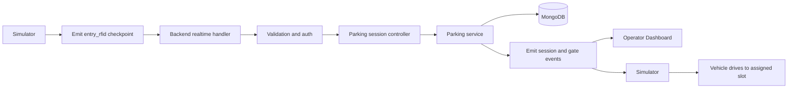

# NT131 Smart Parking Project

## Description
This is a smart parking management project built for educational purposes.

The repository includes:
- Backend API and realtime gateway.
- Frontend operator/admin dashboard.
- Standalone 3D simulator for vehicle entry and exit flow.

The system supports RFID verification, parking session lifecycle, slot assignment, and realtime synchronization between operator UI and simulator.

## Technologies
We are using the following technologies:

- Node.js
- TypeScript
- Express.js
- MongoDB
- Mongoose
- Socket.IO
- React + Vite
- Zustand
- React Router
- React Three Fiber + Three.js (simulator)
- Docker and Docker Compose

## Installation and Running
You can run this project in two ways:

- Docker Compose for full-stack quick start.
- Local development for each app (backend, frontend, simulator).

## Infrastructure
### Option 1: Docker Compose (full stack)
Run from repository root:

```bash
docker compose up --build -d
```

After running, services are available at:
- Backend API: http://localhost:3000/api/v1
- Socket.IO: http://localhost:3000/socket.io
- Frontend: http://localhost:8080
- Simulator 3D: http://localhost:8081

### Option 2: Local development
#### 1) Backend
```bash
cd backend
cp .env.example .env
npm install
npm run dev
```

Default local backend:
- API: http://localhost:5000/api/v1
- Socket.IO: http://localhost:5000/socket.io

#### 2) Frontend
```bash
cd frontend
cp .env.example .env
npm install
npm run dev
```

Frontend default URL: http://localhost:5173

#### 3) Simulator 3D
Create `.env` inside `simulator-3d` if needed:

```env
VITE_API_BASE_URL=http://localhost:5000/api/v1
VITE_SOCKET_URL=http://localhost:5000
VITE_SIMULATOR_API_KEY=
```

Then run:

```bash
cd simulator-3d
npm install
npm run dev
```

Simulator default URL: http://localhost:5174 (or next free Vite port)

## Project Structure
This repository follows a layered backend architecture and separated frontend apps:

```text
NT131
├── backend
│   ├── src
│   │   ├── controllers
│   │   ├── services
│   │   ├── repositories
│   │   ├── routes
│   │   ├── middlewares
│   │   ├── models
│   │   └── validators
├── frontend
│   └── src
│       ├── api
│       ├── components
│       ├── pages
│       ├── store
│       └── types
├── simulator-3d
│   └── src
│       ├── components
│       ├── lib
│       └── types
└── docs
    ├── architecture
    └── database
```

## API Routes
Main backend routes are under `/api/v1`:

- `/api/v1/auth`
- `/api/v1/residents`
- `/api/v1/rfid-cards`
- `/api/v1/vehicles`
- `/api/v1/pricing-policies`
- `/api/v1/parking/sessions`
- `/api/v1/parking/slots`
- `/api/v1/parking/status`

### Route Flowchart


## Workflow of a Parking Entry
1. Simulator emits checkpoint at entry RFID.
2. Operator verifies RFID/card and plate.
3. Backend creates or updates parking session.
4. Backend emits realtime events (`session.created`, `gate.state.changed`, `slot.assigned`).
5. Simulator receives events and continues animation to assigned slot.

### Workflow Flowchart


## Frontend and Simulator Apps
- Frontend is a role-based UI:
  - `/login`
  - `/operator`
  - `/admin`
- Simulator is a standalone app for 3D flow demonstration and realtime integration testing.

## Development
Planned improvements:
- Add automated tests for key flows.
- Add API documentation (OpenAPI/Postman).
- Improve deployment guides for cloud environments.

## References
- docs/architecture/realtime-event-contract.md
- docs/architecture/operator-integration-contract.md
- docs/architecture/simulator-operator-e2e-checklist.md
- docs/database/note.md
