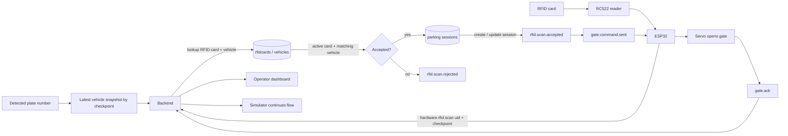
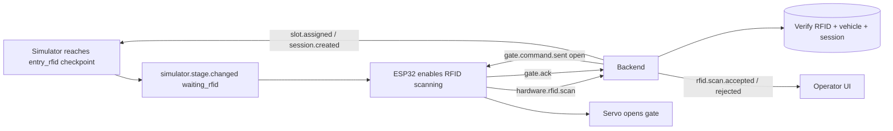

# NT131 Smart Parking

## Tổng quan


Đây là project bãi đỗ xe thông minh cho môn NT131. Hệ thống hỗ trợ cả mô phỏng 3D và phần cứng ESP32 thật, bao gồm:

- Backend API và Socket.IO realtime gateway.
- Dashboard frontend cho operator/admin.
- Bộ mô phỏng 3D cho luồng xe vào/ra và tích hợp với operator.
- Firmware ESP32 để điều khiển barrier, quét RFID RC522, hiển thị LCD và xử lý lệnh realtime.
- FreeRTOS trên ESP32 để tách các workload mạng, RFID, servo, LCD và metrics.
- Bộ công cụ test RTT/ACK, mất gói, reconnect và xử lý RFID để đánh giá hiệu quả của FreeRTOS.

Mục tiêu chính là kiểm chứng một luồng bãi đỗ xe gần với thực tế: simulator phát hiện xe, ESP32 đọc thẻ RFID, backend xác thực thẻ và xe, frontend cập nhật realtime, sau đó ESP32 điều khiển servo mở/đóng barrier.

## Thành phần chính

| Thư mục | Vai trò |
| --- | --- |
| `backend` | API Express + TypeScript, MongoDB/Mongoose, Socket.IO, xác thực, phiên gửi xe, bootstrap phần cứng |
| `frontend` | Dashboard React + Vite cho operator và admin |
| `simulator-3d` | Ứng dụng 3D mô phỏng xe vào/ra, checkpoint RFID và sự kiện realtime |
| `hardware` | Firmware ESP32, cấu hình chân, FreeRTOS task và hướng dẫn đấu nối |
| `tools` | Script test Socket.IO/FreeRTOS, kết quả JSON và biểu đồ sinh tự động |
| `docs` | Tài liệu kiến trúc, hợp đồng realtime và ghi chú database |

## Công nghệ

- Node.js, TypeScript, Express.js
- MongoDB, Mongoose
- Socket.IO
- React, Vite, Zustand, React Router
- React Three Fiber, Three.js
- ESP32 Arduino, FreeRTOS
- RC522 RFID, servo barrier, LCD I2C 16x2
- Docker và Docker Compose

## Kiến trúc hệ thống

```mermaid
flowchart LR
  subgraph HWZONE[ESP32 Hardware + FreeRTOS]
    ESP[ESP32 DevKit]
    RTOS[FreeRTOS Scheduler]

    subgraph TASKS[Runtime Tasks]
      TSOCKET[taskSocketIO]
      TWIFI[taskWifiManager]
      TRFID[taskRfidPolling]
      TSERVO[taskServoControl]
      TLCD[taskLcdDisplay]
      TMETRICS[taskMetrics]
    end

    WIFI[WiFi Adapter]
    RFID[RC522 RFID Reader]
    LCD[16x2 I2C LCD]
    SERVO[Entry / Exit Servos]

    ESP --> RTOS
    RTOS --> TSOCKET
    RTOS --> TWIFI
    RTOS --> TRFID
    RTOS --> TSERVO
    RTOS --> TLCD
    RTOS --> TMETRICS
    TWIFI -->|WiFi connect / reconnect| WIFI
    TRFID -->|SPI read| RFID
    TLCD -->|I2C write| LCD
    TSERVO -->|PWM signal| SERVO
  end

  subgraph BACKEND[Backend and Database]
    API[Express REST API]
    SIO[Socket.IO Gateway]
    DB[(MongoDB)]
    API --> DB
    SIO --> DB
  end

  subgraph CLIENTS[Frontend and Simulator]
    FE[React + Vite Frontend]
    SIM[Three.js Simulator]
  end

  TSOCKET -->|HTTP bootstrap| API
  TSOCKET <-->|Socket.IO hardware room| SIO
  FE <-->|REST + Socket.IO operator room| SIO
  SIM <-->|REST + Socket.IO simulator room| SIO
```



Backend là điểm điều phối trung tâm giữa UI, simulator, database và phần cứng thật:

- REST API được phục vụ dưới `/api/v1`.
- Socket.IO chạy tại `/socket.io`.
- Operator tham gia room `operator`.
- Simulator tham gia room `simulator`.
- ESP32 tham gia room `hardware`.
- ESP32 lấy cấu hình socket từ `/api/v1/hardware/bootstrap`.
- ESP32 chạy các công việc phần cứng trong nhiều FreeRTOS task độc lập để WiFi, RFID polling, servo, LCD và sự kiện realtime có thể chạy đồng thời.

## Luồng vận hành


Luồng vào/ra hoàn chỉnh kết hợp biển số từ simulator, dữ liệu RFID từ ESP32, xác thực ở backend, trạng thái MongoDB và điều khiển servo:



Các bước chính:

| Bước | Thành phần | Hành động | Dữ liệu chính |
| --- | --- | --- | --- |
| 1 | Simulator / camera context | Xe tới checkpoint `entry_rfid` hoặc `exit_rfid` | Biển số, checkpoint, correlation id |
| 2 | ESP32 + RC522 | Quét thẻ RFID và gửi về backend | UID, checkpoint, correlation id |
| 3 | Backend + MongoDB | Kiểm tra thẻ RFID đang hoạt động, xe liên kết và trạng thái phiên gửi xe | `rfidcards`, `vehicles`, `parkingsessions` |
| 4 | Backend | Phát kết quả accepted/rejected và tạo hoặc cập nhật phiên gửi xe | `rfid.scan.accepted`, `rfid.scan.rejected`, `session.*` |
| 5 | Backend + ESP32 | Gửi lệnh điều khiển barrier tới phần cứng | `gate.command.sent` |
| 6 | ESP32 + FreeRTOS | Servo task nhận lệnh trong queue và mở/đóng barrier | Tín hiệu PWM servo, `gate.ack` |
| 7 | Frontend + Simulator | UI operator và simulator nhận cập nhật realtime | `realtime.event`, sự kiện gate/session/slot |

## Chạy nhanh với Docker Compose

Tạo file `backend/.env` trước khi chạy toàn bộ stack:

```bash
cd backend
cp .env.example .env
cd ..
```

Chạy từ thư mục root của repository:

```bash
docker compose up --build -d
```

URL mặc định:

- Backend API: `http://localhost:3000/api/v1`
- Socket.IO: `http://localhost:3000/socket.io`
- Frontend: `http://localhost:8080`
- Simulator 3D: `http://localhost:8081`

## Phát triển local

### Backend

```bash
cd backend
cp .env.example .env
npm install
npm run dev
```

Backend local mặc định:

- API: `http://localhost:5000/api/v1`
- Socket.IO: `http://localhost:5000/socket.io`

### Frontend

```bash
cd frontend
cp .env.example .env
npm install
npm run dev
```

URL Vite mặc định: `http://localhost:5173`.

### Simulator 3D

```bash
cd simulator-3d
npm install
npm run dev
```

URL Vite mặc định: `http://localhost:5174`, hoặc port Vite khả dụng tiếp theo.

### Phần cứng ESP32

1. Sao chép file cấu hình phần cứng:

```bash
cp hardware/hardware_config.example.h hardware/esp32-gate-socket-controller/hardware_config.h
```

2. Chỉnh WiFi, IP backend, port, key và chân servo trong `hardware_config.h`.
3. Mở `hardware/esp32-gate-socket-controller/esp32-gate-socket-controller.ino` bằng Arduino IDE.
4. Cài các thư viện: `ArduinoJson`, `Socket.IO`, `ESP32Servo`, `MFRC522`, `LiquidCrystal_I2C`.
5. Upload lên ESP32 và mở Serial Monitor.

Xem `hardware/README.md` để đọc hướng dẫn chi tiết.

## Cấu hình quan trọng

Backend `.env`:

```env
PORT=5000
MONGODB_URI=mongodb://localhost:27017/nt131
JWT_SECRET=replace-with-a-strong-secret
JWT_REFRESH_SECRET=replace-with-a-strong-refresh-secret
SOCKET_CORS_ORIGIN=http://localhost:5173,http://localhost:5174
SIMULATOR_API_KEY=
HARDWARE_BOOTSTRAP_KEY=
HARDWARE_SOCKET_HOST=
HARDWARE_SOCKET_PORT=
HARDWARE_SOCKET_PATH=/socket.io
HARDWARE_SOCKET_RECONNECT_INTERVAL_MS=5000
```

Khi ESP32 và backend không chạy trên cùng một máy, cần cấu hình:

- `HARDWARE_SOCKET_HOST`: IP LAN của máy chạy backend, ví dụ `192.168.1.5`.
- `HARDWARE_SOCKET_PORT`: port backend, thường là `5000` khi chạy local hoặc `3000` khi chạy Docker.
- `HARDWARE_BOOTSTRAP_KEY`: khóa bí mật cho endpoint bootstrap phần cứng.

Frontend `.env`:

```env
VITE_API_BASE_URL=http://localhost:5000/api/v1
VITE_SOCKET_URL=http://localhost:5000
VITE_SIMULATOR_API_KEY=
```

## FreeRTOS trên ESP32

Firmware ESP32 được tách thành nhiều FreeRTOS task:

| Task | Core | Độ ưu tiên | Mục đích |
| --- | --- | --- | --- |
| `taskSocketIO` | 1 | Cao | Duy trì Socket.IO, nhận lệnh realtime và phát các sự kiện RFID đã queue |
| `taskRfidPolling` | 0 | Cao | Poll RC522 khi backend/simulator yêu cầu quét RFID |
| `taskServoControl` | 0 | Trung bình | Điều khiển servo qua queue để không chặn socket/RFID |
| `taskWifiManager` | 1 | Trung bình | Theo dõi WiFi và tự reconnect |
| `taskLcdDisplay` | 0 | Thấp | Cập nhật LCD từ display queue |
| `taskMetrics` | 1 | Thấp | In heap, tải queue và stack high-water mark định kỳ |

FreeRTOS cho phép servo chuyển động trong khi RFID và Socket.IO vẫn tiếp tục chạy. Điều này quan trọng vì chuyển động servo có delay theo từng bước; nếu dùng `loop()` theo kiểu blocking thì có thể làm trễ hoặc bỏ lỡ sự kiện realtime.

Tài liệu chi tiết: `hardware/esp32-gate-socket-controller/FREERTOS_IMPLEMENTATION.md`.

## Kiểm thử hiệu quả FreeRTOS

Thư mục `tools` chứa các script test realtime:

- `Test1`: gửi liên tiếp lệnh mở/đóng barrier với delay ngắn.
- `Test2`: luân phiên lệnh barrier vào/ra.
- `Test3`: gửi burst command để quan sát queue, ACK và mất gói.
- `Test4`: đo độ trễ `gate.state.changed`.
- `Test5`: luồng RFID bị từ chối.
- `Test6`: luồng RFID được chấp nhận bằng dữ liệu thẻ/xe thật trong database.
- `Test7`: ép Socket.IO disconnect/reconnect.

Chạy test:

```bash
cd tools
npm install
SOCKET_HOST=http://192.168.1.5:5000 npm run test:test1
SOCKET_HOST=http://192.168.1.5:5000 npm run test:test3
SOCKET_HOST=http://192.168.1.5:5000 npm run test:test7
```

Kết quả được ghi vào:

- `tools/results/*.json`: số lệnh, ACK, số gói mất, RTT trung bình, p95, p99 và max.
- `tools/charts/*.png`: biểu đồ sinh bởi script Python.

Khi test ESP32 FreeRTOS, nên theo dõi thêm các dòng Serial bắt đầu bằng `[metrics]`:

- Free heap và minimum heap.
- Tải của `queueServoCommand`, `queueRfidEvent` và `queueDisplay`.
- Stack high-water mark của từng task.
- RTT và số gói mất trong `tools/results`.

## Luồng xe vào bãi



## API route chính

- `/api/v1/auth`
- `/api/v1/hardware/bootstrap`
- `/api/v1/residents`
- `/api/v1/rfid-cards`
- `/api/v1/vehicles`
- `/api/v1/pricing-policies`
- `/api/v1/parking/sessions`
- `/api/v1/parking/slots`
- `/api/v1/parking/status`

## Tài liệu liên quan

- `backend/README.md`
- `frontend/README.md`
- `hardware/README.md`
- `hardware/esp32-gate-socket-controller/FREERTOS_IMPLEMENTATION.md`
- `docs/architecture/realtime-event-contract.md`
- `docs/architecture/operator-integration-contract.md`
- `docs/architecture/simulator-operator-e2e-checklist.md`
- `docs/database/note.md`
