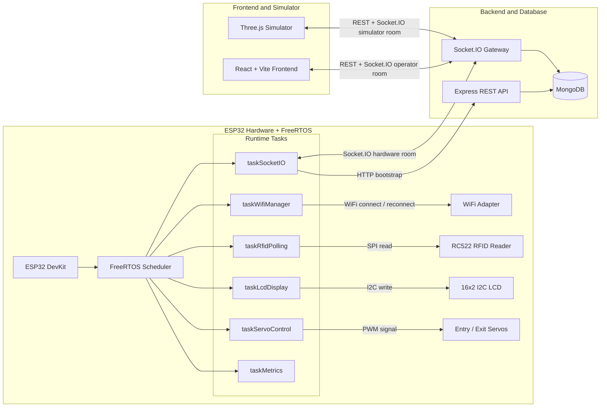
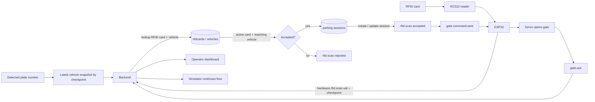
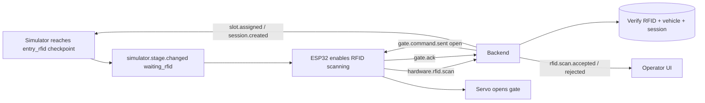

# NT131 Smart Parking

## Overview


This is a smart parking project for NT131. The system now supports both a 3D simulator and real ESP32 hardware, including:

- Backend API and Socket.IO realtime gateway.
- Operator/admin frontend dashboard.
- 3D simulator for vehicle entry/exit flow and operator integration.
- ESP32 firmware for gate control, RC522 RFID scanning, LCD display, and realtime command handling.
- FreeRTOS on ESP32 to split network, RFID, servo, LCD, and metrics workloads.
- Testing tools for RTT/ACK, packet loss, reconnect behavior, and RFID processing to evaluate FreeRTOS effectiveness.

The main goal is to validate a near-real smart parking workflow: the simulator detects vehicles, ESP32 reads RFID cards, the backend verifies cards and vehicles, the frontend updates in realtime, and ESP32 controls the gate servos.

## Main Components

| Directory | Role |
| --- | --- |
| `backend` | Express + TypeScript API, MongoDB/Mongoose, Socket.IO, authentication, parking sessions, hardware bootstrap |
| `frontend` | React + Vite dashboard for operators and admins |
| `simulator-3d` | 3D app for vehicle entry/exit simulation, RFID checkpoints, and realtime events |
| `hardware` | ESP32 firmware, pin configuration, FreeRTOS tasks, and hardware wiring guide |
| `tools` | Socket.IO/FreeRTOS test scripts, JSON results, and generated charts |
| `docs` | ArchitectureKiến trúckiến trúc, tổ chức✓× documents, realtime contracts, and database notes |

## Technologies

- Node.js, TypeScript, Express.js
- MongoDB, Mongoose
- Socket.IO
- React, Vite, Zustand, React Router
- React Three Fiber, Three.js
- ESP32 Arduino, FreeRTOS
- RC522 RFID, servo gates, LCD I2C 16x2
- Docker and Docker Compose

## System ArchitectureKiến trúckiến trúc, tổ chức✓×




The backend is the central coordination point between UI, simulator, database, and real hardware:

- REST API is served under `/api/v1`.
- Socket.IO is served at `/socket.io`.
- Operators join the `operator` room.
- The simulator joins the `simulator` room.
- ESP32 joins the `hardware` room.
- ESP32 fetches socket configuration from `/api/v1/hardware/bootstrap`.
- ESP32 runs hardware work in isolated FreeRTOS tasks so WiFi, RFID polling, servo control, LCD display, and realtime events can progress concurrently.

## Operating Flow


The complete entry/exit flow combines license plate context from the simulator, RFID data from ESP32, backend validation, MongoDB state, and servo control:



Step-by-step:

| Step | Actor | Action | Main data |
| --- | --- | --- | --- |
| 1 | Simulator / camera context | Vehicle reaches `entry_rfid` or `exit_rfid` checkpoint | Plate number, checkpoint, correlation id |
| 2 | ESP32 + RC522 | RFID card is scanned and sent to backend | UID, checkpoint, correlation id |
| 3 | Backend + MongoDB | Backend checks active RFID card, linked vehicle, and current session state | `rfidcards`, `vehicles`, `parkingsessions` |
| 4 | Backend | Backend emits accepted/rejected result and creates or updates a parking session | `rfid.scan.accepted`, `rfid.scan.rejected`, `session.*` |
| 5 | Backend + ESP32 | Backend sends gate command to hardware | `gate.command.sent` |
| 6 | ESP32 + FreeRTOS | Servo task receives queued command and opens/closes gate | PWM servo signal, `gate.ack` |
| 7 | Frontend + Simulator | Operator UI and simulator receive realtime updates | `realtime.event`, gate/session/slot events |

## Quick Start With Docker Compose

Create `backend/.env` before running the stack:

```bash
cd backend
cp .env.example .env
cd ..
```

Run from the repository root:

```bash
docker compose up --build -d
```

Default service URLs:

- Backend API: `http://localhost:3000/api/v1`
- Socket.IO: `http://localhost:3000/socket.io`
- Frontend: `http://localhost:8080`
- Simulator 3D: `http://localhost:8081`

## Local Development

### Backend

```bash
cd backend
cp .env.example .env
npm install
npm run dev
```

Default local backend:

- API: `http://localhost:5000/api/v1`
- Socket.IO: `http://localhost:5000/socket.io`

### Frontend

```bash
cd frontend
cp .env.example .env
npm install
npm run dev
```

Default Vite URL: `http://localhost:5173`.

### Simulator 3D

```bash
cd simulator-3d
npm install
npm run dev
```

Default Vite URL: `http://localhost:5174`, or the next available Vite port.

### ESP32 Hardware

1. Copy the hardware config file:

```bash
cp hardware/hardware_config.example.h hardware/esp32-gate-socket-controller/hardware_config.h
```

2. Edit WiFi, backend IP, port, keys, and servo pins in `hardware_config.h`.
3. Open `hardware/esp32-gate-socket-controller/esp32-gate-socket-controller.ino` in Arduino IDE.
4. Install these libraries: `ArduinoJson`, `Socket.IO`, `ESP32Servo`, `MFRC522`, `LiquidCrystal_I2C`.
5. Upload to ESP32 and open Serial Monitor.

See `hardware/README.md` for the detailed guide.

## Important Configuration

Backend `.env`:

```env
PORT=5000
MONGODB_URI=mongodb://localhost:27017/nt131
JWT_SECRET=replace-with-a-strong-secret
JWT_REFRESH_SECRET=replace-with-a-strong-refresh-secret
SOCKET_CORS_ORIGIN=http://localhost:5173,http://localhost:5174
SIMULATOR_API_KEY=
HARDWARE_BOOTSTRAP_KEY=
HARDWARE_SOCKET_HOST=
HARDWARE_SOCKET_PORT=
HARDWARE_SOCKET_PATH=/socket.io
HARDWARE_SOCKET_RECONNECT_INTERVAL_MS=5000
```

When ESP32 and the backend are not running on the same host, set:

- `HARDWARE_SOCKET_HOST`: LAN IP of the backend machine, for example `192.168.1.5`.
- `HARDWARE_SOCKET_PORT`: backend port, usually `5000` for local development or `3000` for Docker.
- `HARDWARE_BOOTSTRAP_KEY`: secret key for the hardware bootstrap endpoint.

Frontend `.env`:

```env
VITE_API_BASE_URL=http://localhost:5000/api/v1
VITE_SOCKET_URL=http://localhost:5000
VITE_SIMULATOR_API_KEY=
```

## FreeRTOS on ESP32

The ESP32 firmware is split into multiple FreeRTOS tasks:

| Task | Core | Priority | Purpose |
| --- | --- | --- | --- |
| `taskSocketIO` | 1 | High | Maintain Socket.IO, receive realtime commands, emit queued RFID events |
| `taskRfidPolling` | 0 | High | Poll RC522 when the backend/simulator requests RFID scanning |
| `taskServoControl` | 0 | Medium | Control servos through a queue without blocking socket/RFID work |
| `taskWifiManager` | 1 | Medium | Monitor WiFi and reconnect |
| `taskLcdDisplay` | 0 | Low | Update LCD from a display queue |
| `taskMetrics` | 1 | Low | Print heap, queue load, and task stack high-water marks periodically |

FreeRTOS lets the servo move while RFID and Socket.IO keep running. This matters because servo sweeps include step delays; a blocking `loop()` implementation can delay or miss realtime events.

Detailed documentation: `hardware/esp32-gate-socket-controller/FREERTOS_IMPLEMENTATION.md`.

## FreeRTOS Effectiveness Testing

The `tools` directory contains realtime test scripts:

- `Test1`: consecutive gate commands with short delays.
- `Test2`: alternating entry/exit gate commands.
- `Test3`: burst command flood to observe queues, ACKs, and loss.
- `Test4`: measures `gate.state.changed` latency.
- `Test5`: RFID rejection path.
- `Test6`: RFID accepted path using real card/vehicle data in the database.
- `Test7`: forced Socket.IO disconnect/reconnect.

Run tests:

```bash
cd tools
npm install
SOCKET_HOST=http://192.168.1.5:5000 npm run test:test1
SOCKET_HOST=http://192.168.1.5:5000 npm run test:test3
SOCKET_HOST=http://192.168.1.5:5000 npm run test:test7
```

Results are written to:

- `tools/results/*.json`: command count, ACKs, lost count, average RTT, p95, p99, max.
- `tools/charts/*.png`: charts generated by the Python plotting script.

When testing ESP32 FreeRTOS, also monitor Serial output lines starting with `[metrics]`:

- Free heap and minimum heap.
- Load of `queueServoCommand`, `queueRfidEvent`, and `queueDisplay`.
- Stack high-water marks for each task.
- RTT and lost count in `tools/results`.

## Parking Entry Flow



## Main API Routes

- `/api/v1/auth`
- `/api/v1/hardware/bootstrap`
- `/api/v1/residents`
- `/api/v1/rfid-cards`
- `/api/v1/vehicles`
- `/api/v1/pricing-policies`
- `/api/v1/parking/sessions`
- `/api/v1/parking/slots`
- `/api/v1/parking/status`

## Related Documentation

- `backend/README.md`
- `frontend/README.md`
- `hardware/README.md`
- `hardware/esp32-gate-socket-controller/FREERTOS_IMPLEMENTATION.md`
- `docs/architecture/realtime-event-contract.md`
- `docs/architecture/operator-integration-contract.md`
- `docs/architecture/simulator-operator-e2e-checklist.md`
- `docs/database/note.md`
